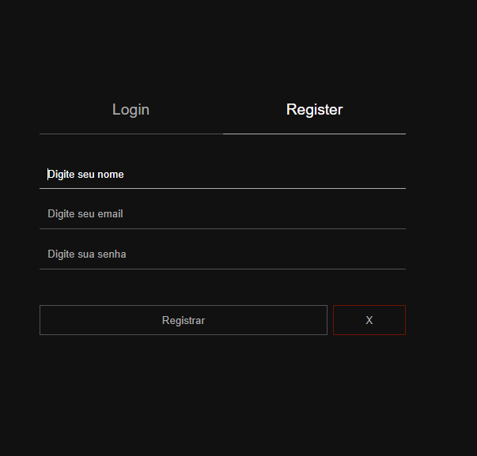
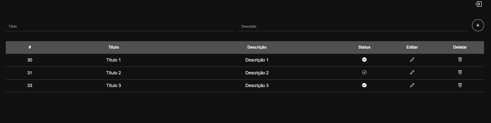
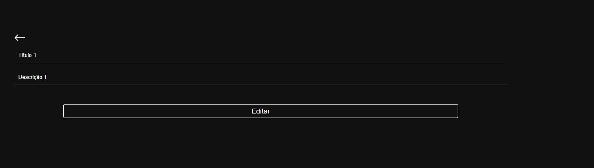

# ToDo List 

## Telas do projeto
<div float="left">
    
    
    
</div>

## Sobre
Primeiro projeto feito utilizando TypeScript e o integrando com Node e React. Também foi a primeira vez utilizando o Prisma. A aplicação é um ToDo List padrão, com opções de criar uma tarefa, deletar editar e alterar seu estado para feito ou não.

# Tecnologias utilizadas
## Back end
    - Nodejs/ Express
    - TypeScript
    - MySQL
    - JWT
    - Prisma
## Front end
    - HTML / CSS
    - React
    - Context API
    - TypeScript

# Executando o projeto
## Back end
```bash
# clonar o projeto
git clone https://github.com/diegocruz-s/todo-react-node-ts

# entrar no diretório
cd server

# criar um arquivo .env na raíz do diretório e o preencher de acordo com o .env.example

# instalar as dependências
npm install

# rodar o back end
npm run dev
```

## Front end
```bash
# entrar no diretório
cd web

# instalar as dependências
npm install

# rodar o projeto
npm run dev
```

# Autor
<p>Diego Cruz's</p>
<a href="https://www.linkedin.com/in/diegoscruz/">https://www.linkedin.com/in/diegoscruz/</a>
